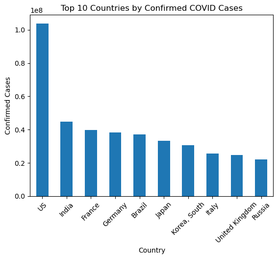
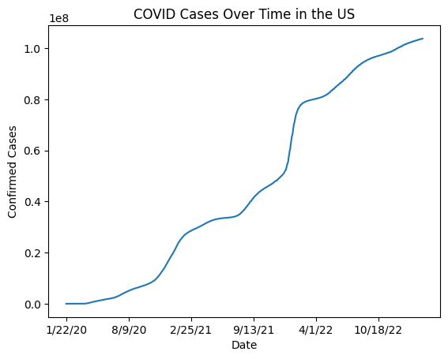

# COVID-19 Global Data Analysis Project

## Overview
This project analyzes global COVID-19 confirmed case data using Python.

The goal of this project is to explore COVID-19 trends across different countries and create data visualizations to better understand the spread of cases worldwide.

## Technologies Used
- Python
- Pandas
- Matplotlib
- Plotly

## Dataset
The dataset contains global COVID-19 time series data including:
- Country/Region
- Province/State
- Dates
- Confirmed COVID-19 cases

## Features
- Loaded and explored COVID-19 data
- Found countries with the highest confirmed cases
- Created a bar chart showing the top 10 countries by cases
- Created a line graph showing COVID-19 growth over time in the United States
- Created an interactive world map visualization

## Visualizations

### Top 10 Countries by COVID Cases

### US COVID Cases Over Time

## Project Results
The analysis found the countries with the highest confirmed COVID-19 cases and displayed global case differences using interactive visualizations.

## How to Run

1. Install the required Python packages:
pip install -r requirements.txt
2. Run the project:
python covid_analysis.py

## Author
Brandon Holland
